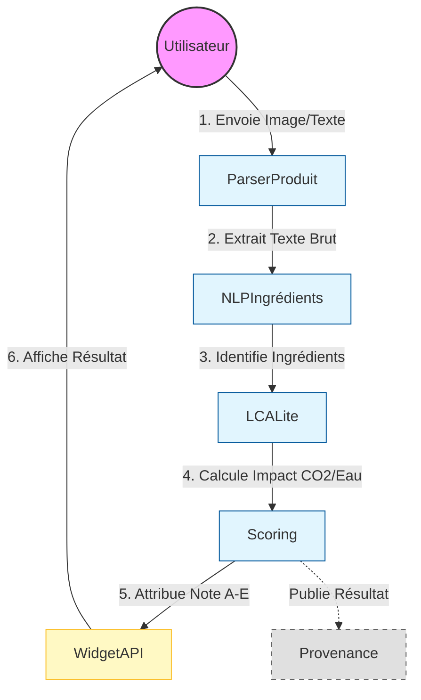

# Diagramme BPMN - Processus de Calcul EcoScore

Voici le code source Mermaid pour générer le diagramme BPMN du processus EcoLabel.
Vous pouvez visualiser ce diagramme directement dans un éditeur Markdown compatible ou sur [Mermaid Live Editor](https://mermaid.live).

## Description détaillée du processus

1.  **Démarrage** : L'utilisateur soumet une photo ou un fichier (PDF/HTML) d'un produit alimentaire.
2.  **Extraction (ParserProduit)** : Le système reçoit le fichier, applique l'OCR (Tesseract) pour extraire tout le texte visible et les métadonnées techniques.
3.  **Analyse Sémantique (NLPIngrédients)** : Le texte brut est analysé pour identifier les entités nommées (Ingrédients spécifiques, Origine géographique, Labels).
4.  **Calcul d'Impact (LCALite)** :
    *   Le système récupère les facteurs d'émission pour chaque ingrédient identifié.
    *   Il calcule l'empreinte carbone, la consommation d'eau et d'énergie totales (Ingrédients + Emballage + Transport).
5.  **Notation (Scoring)** :
    *   Les impacts bruts sont normalisés.
    *   Une pondération est appliquée (ex: 50% CO2, 25% Eau).
    *   Une note finale (Score sur 100) et une classe (A, B, C, D, E) sont générées.
6.  **Restitution (WidgetAPI)** : Le résultat est formaté et affiché à l'utilisateur via l'interface web.
7.  **Audit (Provenance)** : En arrière-plan, toutes les versions de modèles et paramètres utilisés pour ce calcul sont archivés pour traçabilité.
