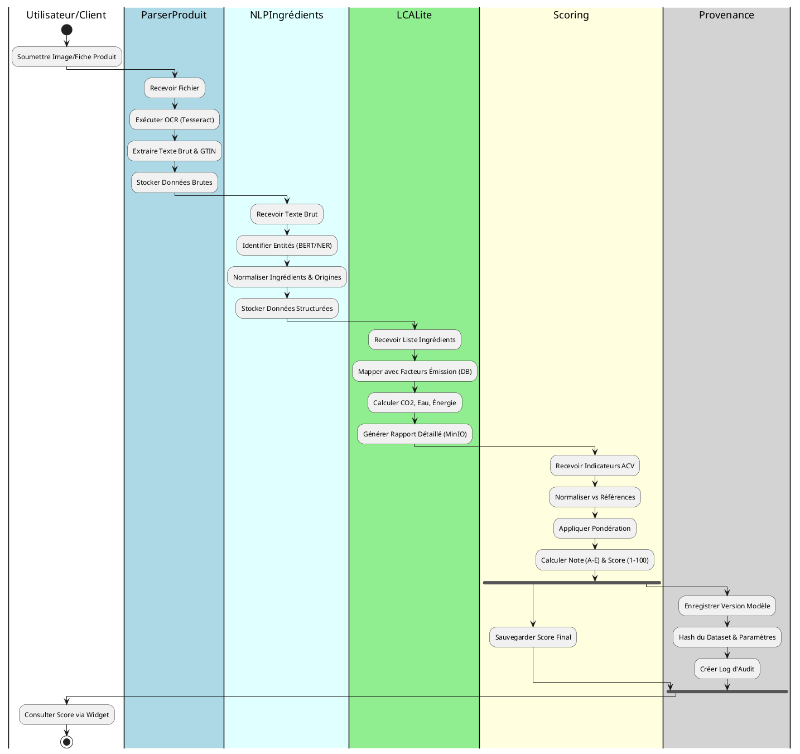

# 2. Diagramme BPMN et Processus Métiers

## 2.1 Vue d’ensemble des processus métiers

Le système EcoLabel orchestre une chaîne de valeur complète pour transformer une donnée produit brute (image, fiche technique) en une information consommateur simple (Eco-Score).

Le parcours débute par **l'ingestion** d'un document numérique représentant le produit. Ce document traverse une étape d'**extraction technique** (OCR) puis une **analyse sémantique** par Intelligence Artificielle pour identifier les composants (ingrédients, matériaux). Ces composants structurés alimentent un moteur de **calcul ACV** (Analyse de Cycle de Vie) qui interroge des bases de connaissances environnementales. Les indicateurs résultants sont ensuite normalisés par un module de **scoring** pour produire une note finale. Enfin, cette note est rendue disponible au consommateur via un **Widget Web**, tandis que l'intégralité du calcul est archivée dans un registre de **provenance** pour garantir l'auditabilité.

## 2.2 Diagramme BPMN global

Voici le diagramme BPMN modélisé avec **PlantUML**. Vous pouvez copier ce code dans un éditeur PlantUML pour visualiser le graphique.

## 2.3 Description détaillée des processus métiers

### 2.3.1 Processus d’ingestion et de parsing des produits (ParserProduit)
Ce processus est le point d'entrée technique. Il prend en charge la disparité des formats d'entrée (PDF, JPG, PNG, HTML). Le système valide d'abord le format du fichier, puis lance des algorithmes de reconnaissance optique de caractères (OCR) si nécessaire. L'objectif est de convertir des pixels ou du code non structuré en une séquence de texte brut encodée en UTF-8, tout en isolant les métadonnées critiques comme le code-barres (GTIN) pour l'identification unique.

### 2.3.2 Processus d’extraction sémantique des ingrédients (NLPIngrédients)
Une fois le texte brut disponible, ce processus fait appel à l'Intelligence Artificielle. Un modèle de Traitement du Langage Naturel (NLP) scanne le texte pour repérer des sémantiques spécifiques : noms d'aliments, additifs, pourcentages, et lieux géographiques. Il nettoie ensuite ces données (ex: "tomates 20%" devient "Ingredient: tomate, Qty: 0.2") pour fournir une liste structurée et standardisée exploitable par le moteur de calcul.

### 2.3.3 Processus de calcul ACV simplifié (LCALite)
C'est le cœur scientifique du système. Pour chaque ingrédient et matériau d'emballage identifié, le processus interroge une base de données de facteurs d'émission (type Agribalyse). Il multiplie les quantités par les impacts unitaires (kg CO2eq/kg, L eau/kg) et agrège les résultats. Il ajoute également des estimations pour le transport et la fin de vie. Le résultat est un vecteur d'impacts environnementaux bruts.

### 2.3.4 Processus de calcul de l’éco-score (Scoring)
Ce processus traduit les données scientifiques complexes en une information marketing simple. Il compare les vecteur d'impacts obtenus aux limites planétaires ou à des produits de référence (Benchmark). Il applique une formule de pondération (ex: le Climat pèse 50% de la note) pour obtenir un score unique sur 100. Ce score est ensuite discrétisé selon une échelle (A-E) pour l'affichage.

### 2.3.5 Processus de consultation du score par le client (WidgetAPI / UI)
C'est le processus de restitution. L'utilisateur final accède à une interface web (Widget UI). Cette interface interroge l'API (Widget API) avec le nom du produit. L'API récupère le dernier score valide en base de données et le renvoie. L'interface affiche alors le badge couleur (A, B...) et permet éventuellement de "driller" pour voir le détail des impacts (Carbone, Eau).

### 2.3.6 Processus de traçabilité et d’audit (Provenance)
Ce processus parallèle et silencieux s'exécute à la fin de chaque calcul. Il capture le contexte d'exécution : quelle version du logiciel était utilisée ? Quelle version de la base de données d'ingrédients ? Quels étaient les poids de pondération ? Ces informations sont scellées dans un registre immuable, permettant de reproduire le calcul ultérieurement ou de justifier la note en cas de contrôle.
