# 4. Conception de Chaque Microservice

Voici les diagrammes UML (Classes et Cas d'Utilisation) générés en syntaxe **PlantUML** pour chaque microservice.

---

## 4.1 Microservice ParserProduit

### 4.1.1 Diagramme de classes – ParserProduit

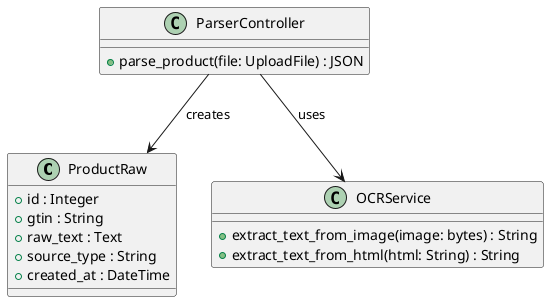

### 4.1.2 Cas d’utilisation – ParserProduit

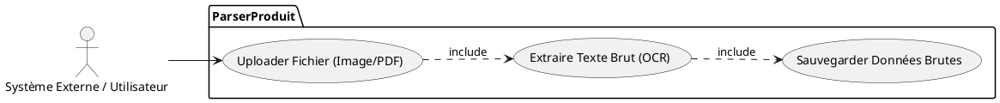

---

## 4.2 Microservice NLPIngrédients

### 4.2.1 Diagramme de classes – NLPIngrédients

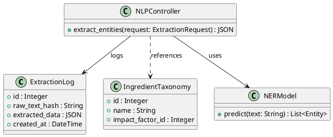

### 4.2.2 Cas d’utilisation – NLPIngrédients

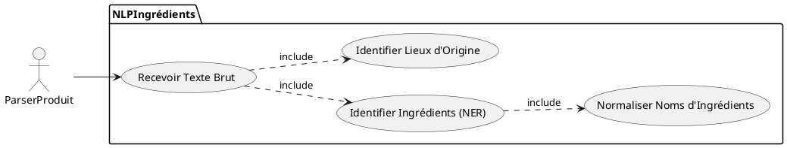

---

## 4.3 Microservice LCALite

### 4.3.1 Diagramme de classes – LCALite

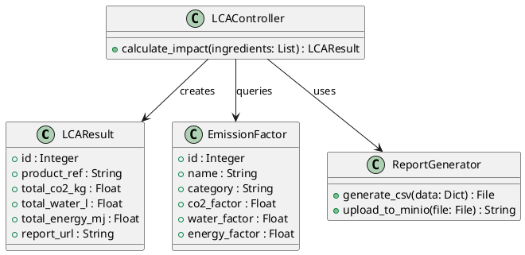

### 4.3.2 Cas d’utilisation – LCALite

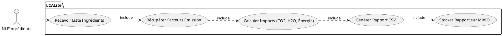

---

## 4.4 Microservice Scoring

### 4.4.1 Diagramme de classes – Scoring

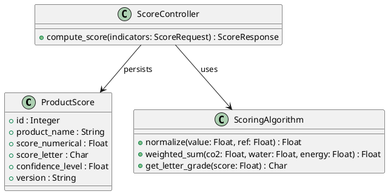

### 4.4.2 Cas d’utilisation – Scoring

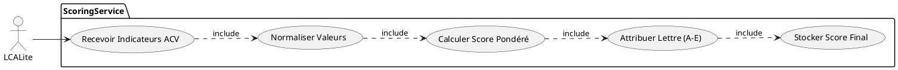

---

## 4.5 Microservice WidgetAPI / Widget UI

### 4.5.1 Diagramme de classes – WidgetAPI / UI

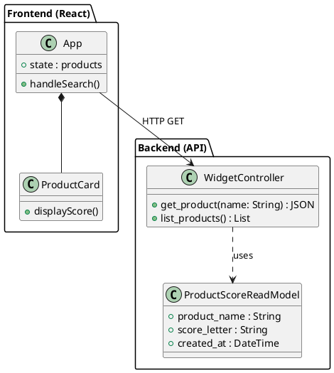

### 4.5.2 Cas d’utilisation – WidgetAPI / UI

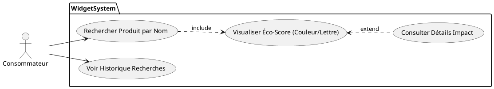

---

## 4.6 Microservice Provenance

### 4.6.1 Diagramme de classes – Provenance

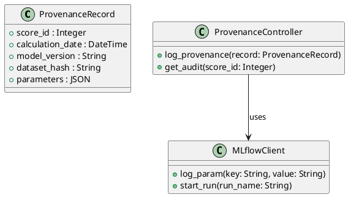

### 4.6.2 Cas d’utilisation – Provenance

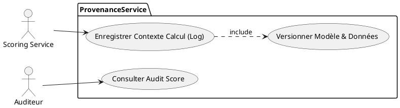
